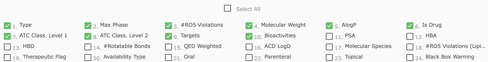
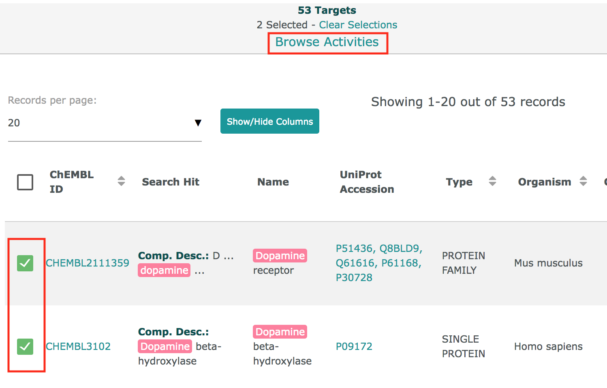
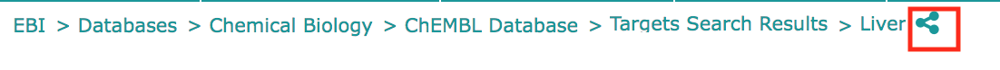

# New Web Interface

## New Features

### Free Text Search

* The bar will provide some suggestions as you write.&#x20;
* You don't need to click on a different button to search for different entity types (Compounds, Targets, Assays, Documents, Cells or Tissues) anymore , the interface will search among all entities for you.&#x20;
* The search bar now appears in all the pages, including report cards, so you don't have to go back to the main page to search for another term.&#x20;
* Our new interface uses elasticsearch indexes, you can use a DSL to build complex queries; more information can be found in the [Interface Questions](https://chembl.gitbook.io/chembl-interface-documentation/frequently-asked-questions/chembl-interface-questions#can-i-edit-the-query-being-used) section.&#x20;

### Structure Search

* You can search by using the [Marvin JS sketcher](https://chemaxon.com/products/marvin-js). You can open it just by clicking on the "structure" icon on the search bar:


* For the substructure and similarity results we have now included structure highlighting on the results. the highlight can be turned on or off. See for example: [https://www.ebi.ac.uk/chembl/g/#substructure\_search\_results/CC(%3DO)Oc1ccccc1C(%3DO)O](https://www.ebi.ac.uk/chembl/g/#substructure\_search\_results/CC\(%3DO\)Oc1ccccc1C\(%3DO\)O)

### Filters

For the search results and other results that you can produce in the interface there are filters available at the left side of the page:

 [https://www.ebi.ac.uk/chembl/beta/g/#browse/compounds](https://www.ebi.ac.uk/chembl/beta/g/#browse/compounds)

With these filters you can easily see the distribution of the data. The sizes of the rectangles behind each value represent the proportion of items with that value for that property in the data. You can also click on the filter the data.

By clicking on the "settings" button


You can open a menu to configure the filters panel



### Browsing activities

You can see the related activities of compound, target, document, assay, cell line, or tissue by clicking on the visualisations. For example for the compound [CHEMBL59](https://www.ebi.ac.uk/chembl/compound\_report\_card/CHEMBL59/) you will see this pie chart in Activity Charts:


If you click on the section that represents "Potency" you will be directed to the [activities](https://www.ebi.ac.uk/chembl/g/#browse/activities/filter/molecule\_chembl\_id%3A\(%22CHEMBL59%22%20OR%20%22CHEMBL3247442%22%20OR%20%22CHEMBL1557%22\)%20AND%20standard\_type%3A\(%22Potency%22\)) of type "Potency" for compound CHEMBL59.

In the results pages, you can also select several items and then click on "Browse Activities", you will be directed to a list of the activities for the items that you selected:



### Data Visualisations

In order to show in a better way what is inside [ChEMBL](https://www.ebi.ac.uk/chembl/beta/) we have created some data visualisations. You can see them in the main page, or by visiting [https://www.ebi.ac.uk/chembl/beta/visualise/](https://www.ebi.ac.uk/chembl/beta/visualise/).

### Descriptive URLs

The urls in the new interface are intended to always describe the data that is being shown. For example, when you search targets using the term 'Liver', the url is:

```
https://www.ebi.ac.uk/chembl/beta/g/#search_results/targets/query=Liver
```

You should be able to copy any url in the page and send it to another person, so the receiver can see the same data. You can also get a shortened version of the url by clicking on the "share" icon of the breadcrumbs:


