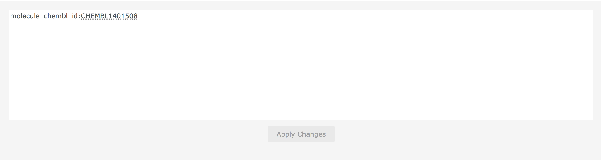
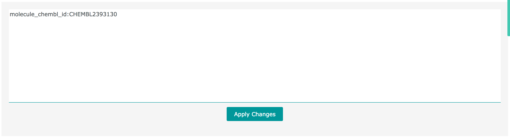

# ChEMBL Interface Questions

## Visualisation Questions

### What is the source of the hierarchy in the Protein Target Classification visualisation?

You can see this visualisation in the [main page](https://www.ebi.ac.uk/chembl/beta/) carousel or in the [visualisations page](https://www.ebi.ac.uk/chembl/beta/visualise/).


 This is the same classification that you will see in a target report card in the 'Protein Target Classification' row. For example, for the target [CHEMBL2737](https://www.ebi.ac.uk/chembl/beta/target_report_card/CHEMBL2737/) you will see the following:


This means that in the visualisation, you can click on the 'Membrane receptor' arc, then on 'Family A G protein-coupled receptor', then on 'Small molecule receptor \(family A GPCR\)', then on 'Monoamine receptor', and finally on 'Dopamine receptor'. The button below will change dynamically while you click and after the last click you should see the following:


If you click on that button, you will see [all the targets with that classification](https://www.ebi.ac.uk/chembl/beta/g/tiny/8h-5axVXnWHniIBp7NzKjw==) and you will find [CHEMBL2737](https://www.ebi.ac.uk/chembl/beta/target_report_card/CHEMBL2737/). 

Also, you can get the raw data used in the visualisation by running the following command in a terminal to query our elasticsearch cluster: 

```bash
curl -XGET "https://www.ebi.ac.uk/chembl/glados-es/chembl_24_1_target/_search" -H 'Content-Type: application/json' -d'
{  
   "size":0,
   "query":{  
      "query_string":{  
         "query":"*",
         "analyze_wildcard":true
      }
   },
   "aggs":{  
      "children":{  
         "terms":{  
            "field":"_metadata.protein_classification.l1",
            "size":100,
            "order":{  
               "_count":"desc"
            }
         },
         "aggs":{  
            "children":{  
               "terms":{  
                  "field":"_metadata.protein_classification.l2",
                  "size":100,
                  "order":{  
                     "_count":"desc"
                  }
               },
               "aggs":{  
                  "children":{  
                     "terms":{  
                        "field":"_metadata.protein_classification.l3",
                        "size":100,
                        "order":{  
                           "_count":"desc"
                        }
                     },
                     "aggs":{  
                        "children":{  
                           "terms":{  
                              "field":"_metadata.protein_classification.l4",
                              "size":100,
                              "order":{  
                                 "_count":"desc"
                              }
                           },
                           "aggs":{  
                              "children":{  
                                 "terms":{  
                                    "field":"_metadata.protein_classification.l5",
                                    "size":100,
                                    "order":{  
                                       "_count":"desc"
                                    }
                                 },
                                 "aggs":{  
                                    "children":{  
                                       "terms":{  
                                          "field":"_metadata.protein_classification.l6",
                                          "size":100,
                                          "order":{  
                                             "_count":"desc"
                                          }
                                       }
                                    }
                                 }
                              }
                           }
                        }
                     }
                  }
               }
            }
         }
      }
   }
}'
```

## Browsing Related Entities

### After doing a search I obtain X compounds, how can I get counts for the total number of bioactivities?

After doing a search by a term, for example [Taxol](https://www.ebi.ac.uk/chembl/beta/g/#search_results/all/query=Taxol), you will a header like the following in every result per entity:


This means that we found 206 compounds for your search. If you click on the link "Browse Activities":


A new page will open with all the [activities related](https://www.ebi.ac.uk/chembl/beta/g/tiny/xB1NBZge73NTMiwKxpvQXQ==) to the 206 compounds that you obtained:


Here you can see that there are 7807 activities related to the 206 compounds that you found. 

### After doing a search I obtain X compounds, how can I get information about the related targets?

Similarly to the previous answer, lets assume that you searched for [Taxol](https://www.ebi.ac.uk/chembl/beta/g/#search_results/all/query=Taxol), you can click on the "Heatmap" button of the "Compound Results" header:


You will see a heatmap like the following:


* **Orange rectangle:** You can see that there are [1043 targets related](https://www.ebi.ac.uk/chembl/beta/g/tiny/YYX2P/h/OrOYL9ZGFzzkiA==) to the 206 compounds that you obtained. If you click on the text a new page will open with the targets that are related to these compounds.
* **Blue rectangle:** Hover to see a mini report card of each of the compounds, click to go to the report card page. 
* **Red rectangle:** Hover to see a mini report card of each of the targets, click to go to the report card page. 
* **Green rectangle:** Click on a square to open a tooltip with a link to see all the activities between the compound and target related by that square. For example, If you click on the square relating the compound CHEMBL3545252 and the target Tubulin, you will see all the [activities](https://www.ebi.ac.uk/chembl/beta/g/tiny/oW+U32lw6/IMI6N+ldRS5Q==) relating that compound with that target.

### What does the 'Bioactivities' filter mean?

When you are browsing a set of compounds, targets, assays, documents, cell lines or tissues, in the filters on the left you will see a filter like this one:

 


You can see an example [here](https://www.ebi.ac.uk/chembl/beta/g#browse/compounds/filter/Taxol). This example shows 206 compounds:


The filter means:

* 27 out of the 206 compounds have 1 related bioactivity. 
* 65 out of the 206 compounds have 2 related bioactivities.
* etc...
* 26 out of the 206 compounds have between 12 to 4989 related bioactivities. 

### **I am browsing some activities, what does the 'Browse Compounds' link mean?**

Similarly to the previous FAQs, this link allows to jump to the related entities for the activities that you are browsing. For example, if you are browsing some [activities](https://www.ebi.ac.uk/chembl/beta/g/tiny//xjDpbfQBoNotsaQY3p4Xg==), you will see a header like this one:


The link will be disabled if you are seeing more than 1024 activities \(we are currently working on ways to increase this limit\). You need to select or filter the activities to activate the link. For example, you can filter only the activities of type 'EC50':


Now the link should be activated:


If you click on the link, a new tab will open with the compounds that are related to the activities that you are seeing. So, in this case, you will see the [compounds related to the 176 activities that you obtained](https://www.ebi.ac.uk/chembl/beta/g/tiny/hFRLL0UVHVGmcHOtXlBgfA==). 

You can also browse other entities, you just have to click on the ellipsis next to the link, this will display all the available entities. 


## Query Questions

### I am seeing a list of compounds \(or targets, assays, etc...\), how can I see the query used?

The 'browse entity' sections are used through all the interface to show subsets of data in ChEMBL. For example, to see the activities related to the compound [SILIBININ](https://www.ebi.ac.uk/chembl/beta/compound_report_card/CHEMBL1401508/) you can go to this [page](https://www.ebi.ac.uk/chembl/beta/g/#browse/activities/filter/molecule_chembl_id%3ACHEMBL1401508) and see a 'browse activities' section. From all the activities in ChEMBL, the activities related to [SILIBININ](https://www.ebi.ac.uk/chembl/beta/compound_report_card/CHEMBL1401508/) can be obtained with the following query to our Elasticsearch system:

```javascript
{
  "size": 20,
  "from": 0,
  "_source": {
    "includes": [
      "*",
      "_metadata.*"
    ],
    "excludes": [
      "_metadata.related_targets.chembl_ids.*",
      "_metadata.related_compounds.chembl_ids.*"
    ]
  },
  "query": {
    "bool": {
      "must": [
        {
          "query_string": {
            "analyze_wildcard": true,
            "query": "molecule_chembl_id:CHEMBL1401508"
          }
        }
      ],
      "filter": []
    }
  },
  "sort": []
}
```

These queries are generated by the interface automatically. But if you want to see the query, you can click on the 'See Full Query' button:


  
This section will show you the full query being sent to Elasticsearch, you can copy it so you can use it in your own scripts. 

### Can I edit the query being used?

In some cases, the query that the interface uses is based in a [Querystring](https://www.elastic.co/guide/en/elasticsearch/reference/current/query-dsl-query-string-query.html), this is an element of the Elasticsearch DSL, it is "A query that uses a query parser in order to parse its content.". You can see more information [here](https://www.elastic.co/guide/en/elasticsearch/reference/current/query-dsl-query-string-query.html). Soon, we will add an explanation of the elasticsearch "schema" of ChEMBL. Similarly to the previous question,  to get the activities related to [SILIBININ](https://www.ebi.ac.uk/chembl/beta/compound_report_card/CHEMBL1401508/) you can use the following querystring:

```javascript
molecule_chembl_id:CHEMBL1401508
```

Remember that a querystring is only part of the full query, in the previous question, you can see this in the full query:

```javascript
"query_string": {
  "analyze_wildcard": true,
  "query": "molecule_chembl_id:CHEMBL1401508"
}
```

When the query is based in a querystring, it can be edited. First you need to click on the 'Edit Querystring' Button:


  
This will open a text area that will let you edit the querystring:



  
When you write a different querystring, the "Apply Changes' button will activate and will fetch the new items. For example, if you want to get the activities related to [APABETALONE](https://www.ebi.ac.uk/chembl/beta/compound_report_card/CHEMBL2393130/) instead, you can write the following querystring:

```javascript
molecule_chembl_id:CHEMBL2393130
```

And then click on 'Apply Changes':



  
You will now see the activities related to the compound with ChEMBL id CHEMBL2393130. You can see an example of the result here:

[http://www.ebi.ac.uk/chembl/beta/g/tiny/q57I6ShDJTBDqfOK01GYsA==](http://www.ebi.ac.uk/chembl/beta/g/tiny/q57I6ShDJTBDqfOK01GYsA==)

