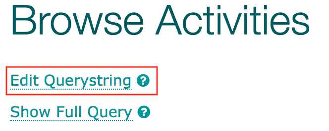

# Interface Questions

## Visualisation Questions

### What is the source of the hierarchy in the Protein Target Classification visualisation?

You can see this visualisation in the [main page](https://www.ebi.ac.uk/chembl/beta/) carousel or in the [visualisations page](https://www.ebi.ac.uk/chembl/beta/visualise/).


&#x20;This is the same classification that you will see in a target report card in the 'Protein Target Classification' row. For example, for the target [CHEMBL2737](https://www.ebi.ac.uk/chembl/target\_report\_card/CHEMBL2737/) you will see the following:

.png>)

This means that in the visualisation, you can click on the 'Membrane receptor' arc, then on 'Family A G protein-coupled receptor', then on 'Small molecule receptor (family A GPCR)', then on 'Monoamine receptor', and finally on 'Dopamine receptor'. The button below will change dynamically while you click and after the last click you should see the following:


If you click on that button, you will see all the targets with that classification and you will find [CHEMBL2737](https://www.ebi.ac.uk/chembl/target\_report\_card/CHEMBL2737/).&#x20;

Also, you can get the raw data used in the visualisation by running the following command in a terminal to query our elasticsearch cluster:&#x20;

```bash
curl -XGET "https://www.ebi.ac.uk/chembl/glados-es/chembl_24_1_target/_search" -H 'Content-Type: application/json' -d'
{  
   "size":0,
   "query":{  
      "query_string":{  
         "query":"*",
         "analyze_wildcard":true
      }
   },
   "aggs":{  
      "children":{  
         "terms":{  
            "field":"_metadata.protein_classification.l1",
            "size":100,
            "order":{  
               "_count":"desc"
            }
         },
         "aggs":{  
            "children":{  
               "terms":{  
                  "field":"_metadata.protein_classification.l2",
                  "size":100,
                  "order":{  
                     "_count":"desc"
                  }
               },
               "aggs":{  
                  "children":{  
                     "terms":{  
                        "field":"_metadata.protein_classification.l3",
                        "size":100,
                        "order":{  
                           "_count":"desc"
                        }
                     },
                     "aggs":{  
                        "children":{  
                           "terms":{  
                              "field":"_metadata.protein_classification.l4",
                              "size":100,
                              "order":{  
                                 "_count":"desc"
                              }
                           },
                           "aggs":{  
                              "children":{  
                                 "terms":{  
                                    "field":"_metadata.protein_classification.l5",
                                    "size":100,
                                    "order":{  
                                       "_count":"desc"
                                    }
                                 },
                                 "aggs":{  
                                    "children":{  
                                       "terms":{  
                                          "field":"_metadata.protein_classification.l6",
                                          "size":100,
                                          "order":{  
                                             "_count":"desc"
                                          }
                                       }
                                    }
                                 }
                              }
                           }
                        }
                     }
                  }
               }
            }
         }
      }
   }
}'
```

##

##

## Browsing Related Entities

### After doing a search I obtain X compounds, how can I get counts for the total number of bioactivities?

After doing a search by a term, for example [Taxol](https://www.ebi.ac.uk/chembl/beta/g/#search\_results/all/query=Taxol), you will a header like the following in every result per entity:

.png>)

This means that we found 206 compounds for your search. If you click on the link "Browse Activities":

.png>)

A new page will open with all the activities related to the 206 compounds that you obtained:

.png>)

Here you can see that there are 7807 activities related to the 206 compounds that you found.&#x20;

### After doing a search I obtain X compounds, how can I get information about the related targets?

Similarly to the previous answer, lets assume that you searched for [Taxol](https://www.ebi.ac.uk/chembl/beta/g/#search\_results/all/query=Taxol), you can click on the "Heatmap" button of the "Compound Results" header:

.png>)

You will see a heatmap like the following:


* **Orange rectangle:** You can see that there are 1043 targets related to the 206 compounds that you obtained. If you click on the text a new page will open with the targets that are related to these compounds.
* **Blue rectangle:** Hover to see a mini report card of each of the compounds, click to go to the report card page.&#x20;
* **Red rectangle:** Hover to see a mini report card of each of the targets, click to go to the report card page.&#x20;
* **Green rectangle:** Click on a square to open a tooltip with a link to see all the activities between the compound and target related by that square. For example, If you click on the square relating the compound CHEMBL3545252 and the target Tubulin, you will see all the activities relating that compound with that target.

### What does the 'Bioactivities' filter mean?

When you are browsing a set of compounds, targets, assays, documents, cell lines or tissues, in the filters on the left you will see a filter like this one:

&#x20;

.png>)

You can see an example [here](https://www.ebi.ac.uk/chembl/beta/g#browse/compounds/filter/Taxol). This example shows 206 compounds:

.png>)

The filter means:

* 27 out of the 206 compounds have 1 related bioactivity.&#x20;
* 65 out of the 206 compounds have 2 related bioactivities.
* etc...
* 26 out of the 206 compounds have between 12 to 4989 related bioactivities.&#x20;

### **I am browsing some activities, what does the 'Browse Compounds' link mean?**

Similarly to the previous FAQs, this link allows to jump to the related entities for the activities that you are browsing. For example, if you are browsing some activities, you will see a header like this one:

.png>)

The link will be disabled if you are seeing more than 1024 activities (we are currently working on ways to increase this limit). You need to select or filter the activities to activate the link. For example, you can filter only the activities of type 'EC50':


Now the link should be activated:


If you click on the link, a new tab will open with the compounds that are related to the activities that you are seeing. So, in this case, you will see the compounds related to the 176 activities that you obtained.&#x20;

You can also browse other entities, you just have to click on the ellipsis next to the link, this will display all the available entities.&#x20;


##


## Query Questions

### I am seeing a list of compounds (or targets, assays, etc...), how can I see the query used?

The 'browse entity' sections are used through all the interface to show subsets of data in ChEMBL. For example, to see the activities related to the compound [SILIBININ](https://www.ebi.ac.uk/chembl/compound\_report\_card/CHEMBL9509/) you can go to [this page](https://www.ebi.ac.uk/chembl/g/#browse/activities/filter/molecule\_chembl\_id%3A\(%22CHEMBL9509%22\)) and see a 'browse activities' section. From all the activities in ChEMBL, the activities related to SILIBININ can be obtained with the following query to our Elasticsearch system:

```javascript
{
  "size": 20,
  "from": 0,
  "_source": {
    "includes": [
      "*",
      "_metadata.*"
    ],
    "excludes": [
      "_metadata.related_targets.chembl_ids.*",
      "_metadata.related_compounds.chembl_ids.*"
    ]
  },
  "query": {
    "bool": {
      "must": [
        {
          "query_string": {
            "analyze_wildcard": true,
            "query": "molecule_chembl_id:CHEMBL1401508"
          }
        }
      ],
      "filter": []
    }
  },
  "sort": []
}
```

These queries are generated by the interface automatically. But if you want to see the query, you can click on the 'See Full Query' button:

.png>)

\
This section will show you the full query being sent to Elasticsearch, you can copy it so you can use it in your own scripts.&#x20;

### Can I edit the query being used?

In some cases, the query that the interface uses is based in a [Querystring](https://www.elastic.co/guide/en/elasticsearch/reference/current/query-dsl-query-string-query.html), this is an element of the Elasticsearch DSL, it is "A query that uses a query parser in order to parse its content.". You can see more information [here](https://www.elastic.co/guide/en/elasticsearch/reference/current/query-dsl-query-string-query.html). Soon, we will add an explanation of the elasticsearch "schema" of ChEMBL. Similarly to the previous question,  to get the activities related to [SILIBININ](https://www.ebi.ac.uk/chembl/compound\_report\_card/CHEMBL9509/) you can use the following querystring:

```javascript
molecule_chembl_id:CHEMBL1401508
```

Remember that a querystring is only part of the full query, in the previous question, you can see this in the full query:

```javascript
"query_string": {
  "analyze_wildcard": true,
  "query": "molecule_chembl_id:CHEMBL1401508"
}
```

When the query is based in a querystring, it can be edited. First you need to click on the 'Edit Querystring' Button:



\
This will open a text area that will let you edit the querystring:

<figure><figcaption></figcaption></figure>

\
When you write a different querystring, the "Apply Changes' button will activate and will fetch the new items. For example, if you want to get the activities related to [APABETALONE](https://www.ebi.ac.uk/chembl/compound\_report\_card/CHEMBL2393130/) instead, you can write the following querystring:

```javascript
molecule_chembl_id:("CHEMBL2393130")
```

And then click on 'Apply Changes'.  You will now see the activities related to the compound with ChEMBL id CHEMBL2393130. &#x20;

## What is the expiry date in the structure based searches from the interface?

When a user performs a structure based search (similarity, substructure, connectivity) from the interface, the results are kept in our servers for 7 days after the results are ready. For example, if a search was finished on 17th May at 8:00 AM, the results will be kept in our servers until 24th May at 8:00 AM. This means that if the same search is requested again during that period, the results will not be generated again and they will be ready immediately. The times shown are always based in the **UTC timezone**.&#x20;

During the period in which we keep the results, we also keep the original query parameters. The parameters and the results are deleted after the expiration time has passed.  It is important to make clear that we don't save any data that can be used to identify the user performing the search. We save just the necessary data to be able to provide the service. &#x20;

### Are my queries stored and if so, are they routinely deleted?

In general, we do not store any queries that our users run. We do not analyse the nature of any queries or structures that are processed through the website. In fact, we use https:// wherever possible to maintain the security of the searches. Additionally, the EBI has terms of use and these can be found at: [http://www.ebi.ac.uk/Information/termsofuse.html](http://www.ebi.ac.uk/Information/termsofuse.html). This will tell you what information is retained by the EBI, if any.

#### Javascript Routing

For the pages that allow to perform [free text search](https://www.ebi.ac.uk/chembl/beta/g/#search\_results/all), [structure and sequence searches](https://www.ebi.ac.uk/chembl/beta/g/#substructure\_search\_results/C1%3DCC%3DC\(C%3DC1\)C1C%3DCC\(%3DCC%3D1\)C1C%3DCC%3DCC%3D1), or [entity browsing](https://www.ebi.ac.uk/chembl/beta/g/#browse/targets). The filter or search term is always processed by javascript first. For example, when you search for Aspirin, the url will be something like:

```
https://www.ebi.ac.uk/chembl/beta/g/#search_results/all/query=Aspirin
```

Notice the part of the url that is after the # symbol:

```
#search_results/all/query=Aspirin
```

This part is stored temporarily **only in the browser**. The search term is then sent to the server for a parsing process. The server responds with the adequate parameters in elasticsearch to show the results, but the search term is never stored in the server.

#### Link Shortening

The urls contain information about the query and the state of the page that you are seeing, you can recreate a subset set of data from its query by just using a saved url. Our goal is that any subset of data in ChEMBL can be represented by a url. However urls can become really long easily. The length of the urls can easily become longer than the maximum length that many common url shortening services can handle, and they can cause trouble with browsers and devices when they are expanded. The interface is capable of generating shorter, fixed length urls so they can be easily shared in emails, chats, etc.

For example, this url:

```
https://www.ebi.ac.uk/chembl/beta/g#browse/activities/filter/molecule_chembl_id%3A(%22CHEMBL59%22%20OR%20%22CHEMBL1557%22%20OR%20%22CHEMBL457419%22%20OR%20%22CHEMBL138040%22%20OR%20%22CHEMBL456176%22%20OR%20%22CHEMBL138921%22%20OR%20%22CHEMBL250711%22%20OR%20%22CHEMBL456817%22%20OR%20%22CHEMBL141970%22%20OR%20%22CHEMBL3247442%22%20OR%20%22CHEMBL1256484%22%20OR%20%22CHEMBL531%22%20OR%20%22CHEMBL31088%22%20OR%20%22CHEMBL160074%22%20OR%20%22CHEMBL301265%22%20OR%20%22CHEMBL512943%22%20OR%20%22CHEMBL350361%22%20OR%20%22CHEMBL348924%22%20OR%20%22CHEMBL1201087%22%20OR%20%22CHEMBL347228%22%20OR%20%22CHEMBL589%22%20OR%20%22CHEMBL1303%22%20OR%20%22CHEMBL1371770%22%20OR%20%22CHEMBL1009%22%20OR%20%22CHEMBL28278%22%20OR%20%22CHEMBL2110793%22%20OR%20%22CHEMBL57241%22%20OR%20%22CHEMBL3545388%22%20OR%20%22CHEMBL2110659%22%20OR%20%22CHEMBL3545010%22%20OR%20%22CHEMBL1743952%22%20OR%20%22CHEMBL2104864%22%20OR%20%22CHEMBL588%22%20OR%20%22CHEMBL300443%22%20OR%20%22CHEMBL718%22%20OR%20%22CHEMBL1328898%22%20OR%20%22CHEMBL1823681%22%20OR%20%22CHEMBL2105069%22%20OR%20%22CHEMBL2105691%22%20OR%20%22CHEMBL1200748%22%20OR%20%22CHEMBL493%22%20OR%20%22CHEMBL1201236%22%20OR%20%22CHEMBL51910%22%20OR%20%22CHEMBL2110687%22%20OR%20%22CHEMBL596802%22%20OR%20%22CHEMBL2103827%22%20OR%20%22CHEMBL459%22%20OR%20%22CHEMBL2106075%22%20OR%20%22CHEMBL1743949%22%20OR%20%22CHEMBL1631970%22%20OR%20%22CHEMBL1631968%22%20OR%20%22CHEMBL2104081%22%20OR%20%22CHEMBL69271%22%20OR%20%22CHEMBL2104184%22%20OR%20%22CHEMBL2106980%22%20OR%20%22CHEMBL1256842%22%20OR%20%22CHEMBL287257%22%20OR%20%22CHEMBL273575%22%20OR%20%22CHEMBL2364614%22%20OR%20%22CHEMBL2106525%22%20OR%20%22CHEMBL3989690%22%20OR%20%22CHEMBL53%22%20OR%20%22CHEMBL3247441%22%20OR%20%22CHEMBL1188395%22%20OR%20%22CHEMBL536282%22%20OR%20%22CHEMBL1172928%22%20OR%20%22CHEMBL1201066%22%20OR%20%22CHEMBL115794%22%20OR%20%22CHEMBL1201728%22%20OR%20%22CHEMBL637%22%20OR%20%22CHEMBL2107365%22%20OR%20%22CHEMBL3989861%22%20OR%20%22CHEMBL1118%22%20OR%20%22CHEMBL337702%22%20OR%20%22CHEMBL1615372%22%20OR%20%22CHEMBL1375743%22%20OR%20%22CHEMBL3989833%22%20OR%20%22CHEMBL1237021%22%20OR%20%22CHEMBL708%22)
```

Can be shortened to:

```
https://www.ebi.ac.uk/chembl/beta/g/tiny/AbCF5DA2XHxgYJqTpptUOQ==
```

The url shortening system works by assigning the code AbCF5DA2XHxgYJqTpptUOQ==, to the parameters in the url.&#x20;

If you want to shorten a url, **the url parameters will be saved in our servers temporarily**. We do not analyse this data or store anything else than the mapping of the code (AbCF5DA2XHxgYJqTpptUOQ==) with the parameters, we can't identify the users that introduced any query, and we don't have any intention of doing it.&#x20;

We keep a count of the usage of the service, it counts how many urls have been shortened or expanded and when. This is to help us analyse the usage of our services and make decisions to improve them in the future.&#x20;

The shortened urls have an expiration date which is shown after the url is shortened. The system will not expand any shortened url after its expiration date and once a week we delete forever all the shortened urls that have expired. &#x20;

Some pages automatically shorten urls in order to create links to related data (e.g to see the activities related to a set of targets), these shortened urls also have an expiration date and are routinely deleted.&#x20;

### Is it possible to search for multiple ChEMBL IDs at the same time?

Yes, using the Advanced Search function.  Below there are some files with molecule ChEMBL IDs that you can use as examples, use them to verify that your input is correct.&#x20;

20 molecule ChEMBL IDs separated by commas in plain text:



20 molecule ChEMBL IDs separated by commas compressed in gzip format:



20 molecule ChEMBL IDs separated by commas compressed in zip format:



5 molecule ChEMBL IDs in CSV format (separated by new lines)



### How do I perform a document similarity search?

More details can be found in this [Blog post](https://chembl.blogspot.com/2013/09/document-similarity-in-chembl.html).&#x20;

We also have an API endpoint:

[https://www.ebi.ac.uk/chembl/api/data/document\_similarity](https://www.ebi.ac.uk/chembl/api/data/document\_similarity)
